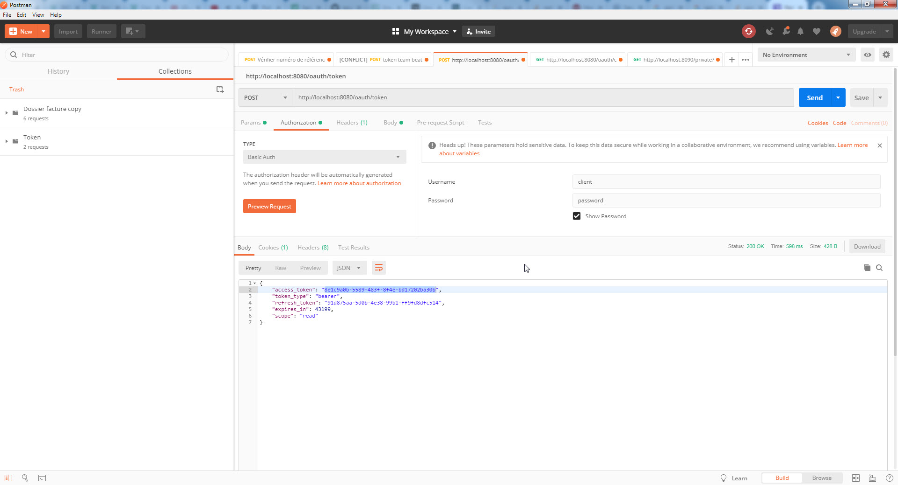

# Application
Serveur de resource Oauth2 permettant d'acceder à des resources privées d'un site internet pour une personne donnée.
Ce serveur permet tester l'accès au serveur d'autorisation OAuth2, pour cela il faut au préalable récupérer un jeton oauth2 à l'issue de la phase 
d'authentification.

Le serveur tourne sur le port 8090\
l'url est http://localhost:8090

Le seul endpoint accessible est /private pour un role ADMIN.

# API REST
Utiliser le logiciel Postman pour pouvoir lancer des requetes GET

## Obtenir un token

http://localhost:8080/oauth/token

## Accéder à la resource

http://localhost:8090/private?id=23

